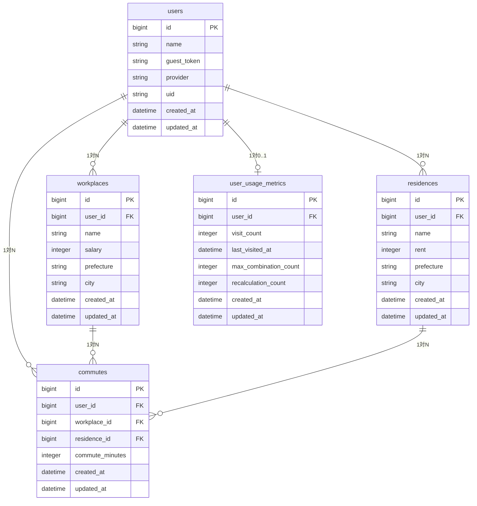

# ER図

## MVP リリース

```mermaid
erDiagram

users {
  bigint id PK
  string name
  string guest_token
  string provider
  string uid
  datetime created_at
  datetime updated_at
}

workplaces {
  bigint id PK
  bigint user_id FK
  string name
  integer salary
  string prefecture
  string city
  datetime created_at
  datetime updated_at
}

residences {
  bigint id PK
  bigint user_id FK
  string name
  integer rent
  string prefecture
  string city
  datetime created_at
  datetime updated_at
}

commutes {
  bigint id PK
  bigint user_id FK
  bigint workplace_id FK
  bigint residence_id FK
  integer commute_minutes
  datetime created_at
  datetime updated_at
}

user_usage_metrics {
  bigint id PK
  bigint user_id FK
  integer visit_count
  datetime last_visited_at
  integer max_combination_count
  integer recalculation_count
  datetime created_at
  datetime updated_at
}

users ||--o{ workplaces : "1対N"
users ||--o{ residences : "1対N"
users ||--o{ commutes : "1対N"
users ||--o| user_usage_metrics : "1対0..1"

workplaces ||--o{ commutes : "1対N"
residences ||--o{ commutes : "1対N"

```
