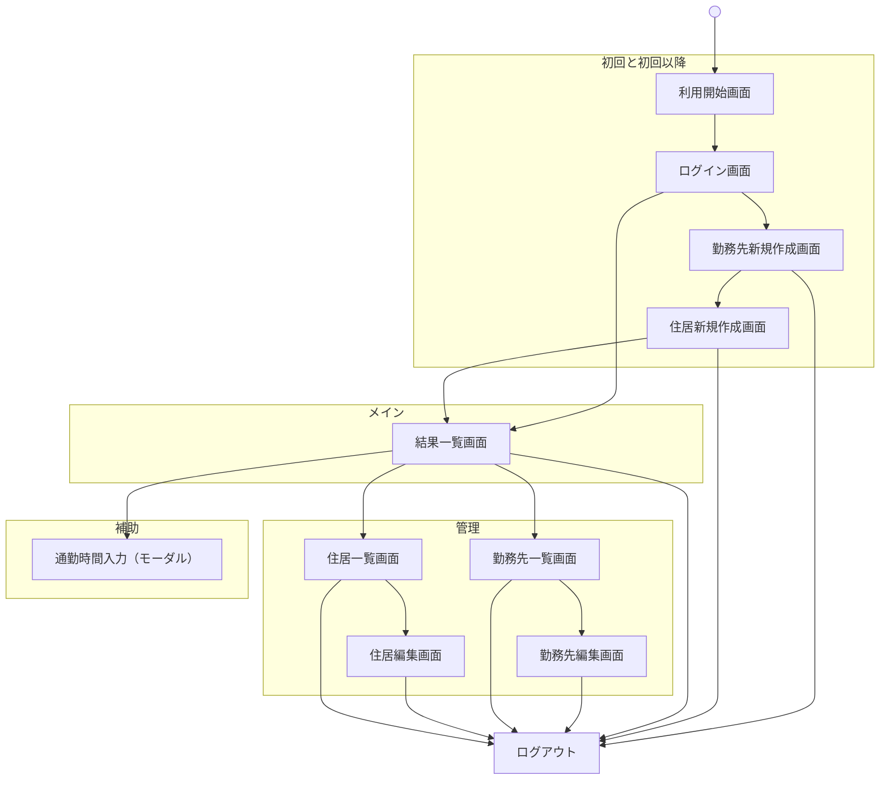

(個人用設計書)
#　画面一覧
- [概要](#概要)
  - [ログイン画面](#ログイン画面)
  - [利用開始画面](#利用開始画面)
  - [勤務先新規作成画面 (STEP表記あり＋なし)](#勤務先新規作成画面-step表記ありなし)
  - [住居新規作成画面 (STEP表記あり＋なし)](#住居新規作成画面-step表記ありなし)
  - [結果一覧画面](#結果一覧画面)
  - [勤務先一覧画面](#勤務先一覧画面)
  - [勤務先編集画面（編集画面=詳細画面）](#勤務先編集画面編集画面詳細画面)
  - [住居一覧画面](#住居一覧画面)
  - [住居編集画面（編集画面=詳細画面）](#住居編集画面編集画面詳細画面)
  - [設定画面](#設定画面)
- [サイトマップ](#サイトマップ)
- [チェックリスト](#チェックリスト)
  - [画面遷移図](#画面遷移図)
  - [本サービスの概要（700文字以内）](#本サービスの概要700文字以内)
  - [READMEに記載した機能（MVP）](#readmeに記載した機能mvp)
  - [未ログインでも閲覧または利用できるページ](#未ログインでも閲覧または利用できるページ)
  - [メールアドレス・パスワード変更確認項目](#メールアドレスパスワード変更確認項目)

## 概要
画面一覧、各画面の概要、画面遷移の情報をまとめた資料
（中間資料）

### ログイン画面

```
------------------------
ログイン

このアプリではデータを保存できます

[ Googleでログイン ]

------------------------
または

名前（任意）
[________]

[ ゲストとして続ける ]

------------------------
※あとからログインできます
------------------------

```

### 利用開始画面

```
------------------------
アプリ名

説明（1〜2行）
「生活のバランスを簡単にシミュレーションできます」
「※あとから編集できます」

名前（任意）
[________]

[はじめる]
------------------------

```

### 勤務先新規作成画面 (STEP表記あり＋なし)

```
------------------------
STEP1 / 2

勤務先名
[________]

給与（手取り）
[________]

勤務地（都道府県）
[________]

勤務地（市区町村）
[________]

[次へ]
------------------------
```


### 住居新規作成画面 (STEP表記あり＋なし)

```
------------------------
STEP2 / 2

住居名
[________]

家賃
[________]

場所（都道府県）
[________]

場所（市区町村）
[________]

[結果を見る]
------------------------
```


### 結果一覧画面
カード形式で縦に並べる（SUUMOの物件情報的な感じ）
複数の勤務先、住居に対して縦に並べる
ソート機能：手取りの↑↓、通勤時間↑↓、余裕の↑↓
3点リーダーから勤務先編集・住居編集可能・組み合わせに対する通勤時間設定

```
------------------------
[＋勤務先を追加]　[＋住居を追加]
並び替え：▼手取り
------------------------
🏢 A社 × 🏠 〇〇   [・・・]    

💰 22万円
⏱ 未入力 → [入力]

😊 余裕あり
------------------------

------------------------
🏢 B社 × 🏠 △△    [・・・] 

💰 18万円
⏱ 60分

😐 普通
------------------------
```
　
### 勤務先一覧画面
（一覧の`[🗑️]ゴミ箱アイコン`から削除可能・確認ダイアログ出したい）

```
------------------------
[＋勤務先を追加]

------------------------
勤務先名  　　　　　　　 [🗑️]
　A社
給与（手取り）
　22万円
勤務地
　東京都品川区
------------------------

------------------------
勤務先名  　　　　　　　 [🗑️]
　B社
給与（手取り）
　18万円
勤務地
　東京都新宿区
------------------------
```

### 勤務先編集画面（編集画面=詳細画面）

```
------------------------
勤務先名
[A社______]

給与（手取り）
[22_______]万円

勤務地（都道府県）
[東京都_____]

勤務地（市区町村）
[品川区____]

[戻る] [保存]
------------------------
```

### 住居一覧画面
（一覧から削除可能・確認ダイアログ出したい）
```
------------------------
[＋住居を追加]


------------------------
住居名  　　　　　　　 [🗑️]
　〇〇
家賃
　6万円
場所（都道府県）
　東京都
場所（市区町村）
　杉並区
------------------------

------------------------
住居名  　　　　　　　 [🗑️]
　△△
家賃
　8万円
場所（都道府県）
　東京都
場所（市区町村）
　世田谷区
------------------------
```

### 住居編集画面（編集画面=詳細画面）

```
------------------------
住居名
[〇〇______]

家賃
[6_______]万円

場所（都道府県）
[東京都____]

場所（市区町村）
[杉並区____]

[戻る]　[保存]
------------------------
```

### 設定画面

```
------------------------
設定

ユーザー名

------------------------
ログアウト
------------------------
```

## サイトマップ



---

## チェックリスト

### 画面遷移図

> [Figma URL](https://www.figma.com/design/XBz0X5VVKhR3G558yZKvfX/RUNTEQ%E5%8D%92%E6%A5%AD%E5%88%B6%E4%BD%9C_%E3%82%B5%E3%83%A1_76aw?node-id=0-1&t=CKG4rfK4hr273v4f-1)

### 本サービスの概要（700文字以内）
就職・転職や引っ越しで選択に迷っている人の、生活がイメージしづらく不安になる課題に対して、通勤時間や可処分所得などをもとに複数パターンを可視化することで、納得して意思決定できる状態を実現することを目的としたアプリです。


### READMEに記載した機能（MVP）
- [x] ログイン機能（ゲストログイン）
- [x] 勤務先（勤務地・給与）の登録機能（会社名などは入れない想定）
- [x] 住居（家賃・名称）の登録機能 (個人情報の観点で住所は入れない)
- [x] 通勤時間（片道入力分を入力、システム側で往復表示）
- [x] 勤務先 × 住居の組み合わせ自動生成機能
- [x] 手取り収入の概算計算機能
- [x] 組み合わせ結果の一覧表示・比較機能
- [x] 生活状態の簡易評価表示機能（例：余裕・普通・やや厳しい など）
　※通勤時間・手取り収入などをもとに簡易的に算出

### 未ログインでも閲覧または利用できるページ
- [x] 利用開始画面

補足）
ゲストログイン→ログイン済としてます

### メールアドレス・パスワード変更確認項目
補足）
ゲストログインはCookieにセッションを保持して認証を行うため変更などはありません。